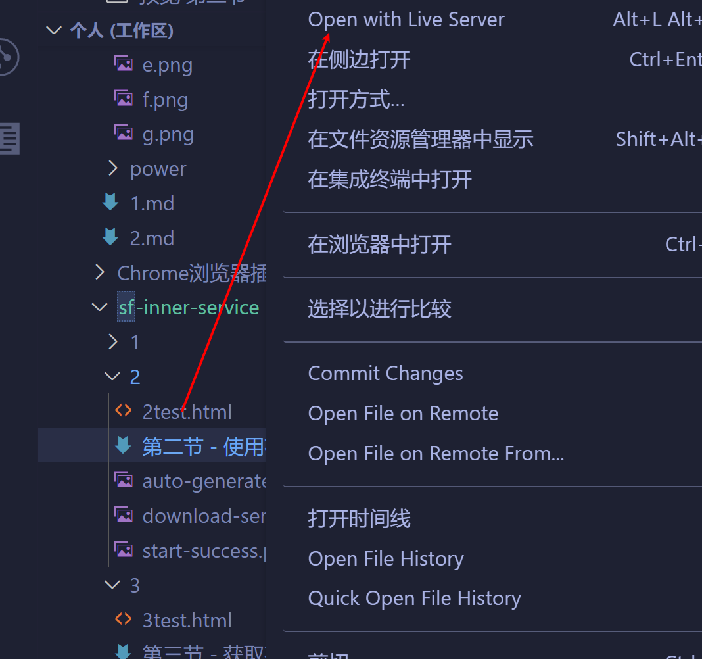

项目地址:https://github.com/xiaodun/sf-inner-service

为了更加纯粹的演示 sf-inner-service 所提供的能力,直接用简单的 html 文件。
VS code 中可以安装 Live Server 插件，单独的 html 文件也可以随着代码的更新刷新页面


下载代码到本地，本地要安装 Node.js 环境。


做一个简单的功能，将文本框的内容通过接口发送给服务器，然后存储起来

解压后安装依赖，执行`npm install`

打开`test.js`

```
const sfInnerService = require("./sfInnerService.js");
sfInnerService.start({
  port: 9000,
});

```

`port: 8089`是服务器运行的端口，如果被占用，则需要更改

执行`node test.js`,启动成功会输出地址，您可以通过这个地址直接访问,当然，和您在同一个局域网下的其它设备也能访问

为了减少本机 ip 地址变化带来的影响，可以使用 localhost、127.0.0.1 代替


输入内容点击保存后

`sf-inner-service`会在 data 文件夹下创建以下结构

```
data
  api
    hero
      chat
        chat.json
        saveWord.js
```


跨域会产生一个 optios 请求，返回结果为"{}"

打开`saveWord.js`,程序生成了默认代码

```
(function () {
  return function (argData, argParams) {
    //argData 数据的副本
    return {
      isWrite: false, //是否覆盖数据
      //data:argData,//需要存储的新数据
      response: {
        //返回的数据
        code: 200,
        data: {},
      },
    };
  };
})();

```

将`chat.json`的内容初始化为 **[]** ,**这一步很关键**,应为存储的结构也有可能是对象**{}**

`argData`是对`chat.json`的解析，

`argParams`携带前端传递过来的参数

实现存储只需要将`saveWord.js`更改为如下格式,无须重启服务

```
(function () {
  return function (argData, argParams) {
    argData.push(argParams.word);
    return {
      isWrite: true,
      data: argData,
      response: {
        code: 200,
        data: {},
      },
    };
  };
})();

```

再次点击保存，此时`chat.json`已经存储了前端传递过来的内容了

```
[
    "23434243243"
]
```
