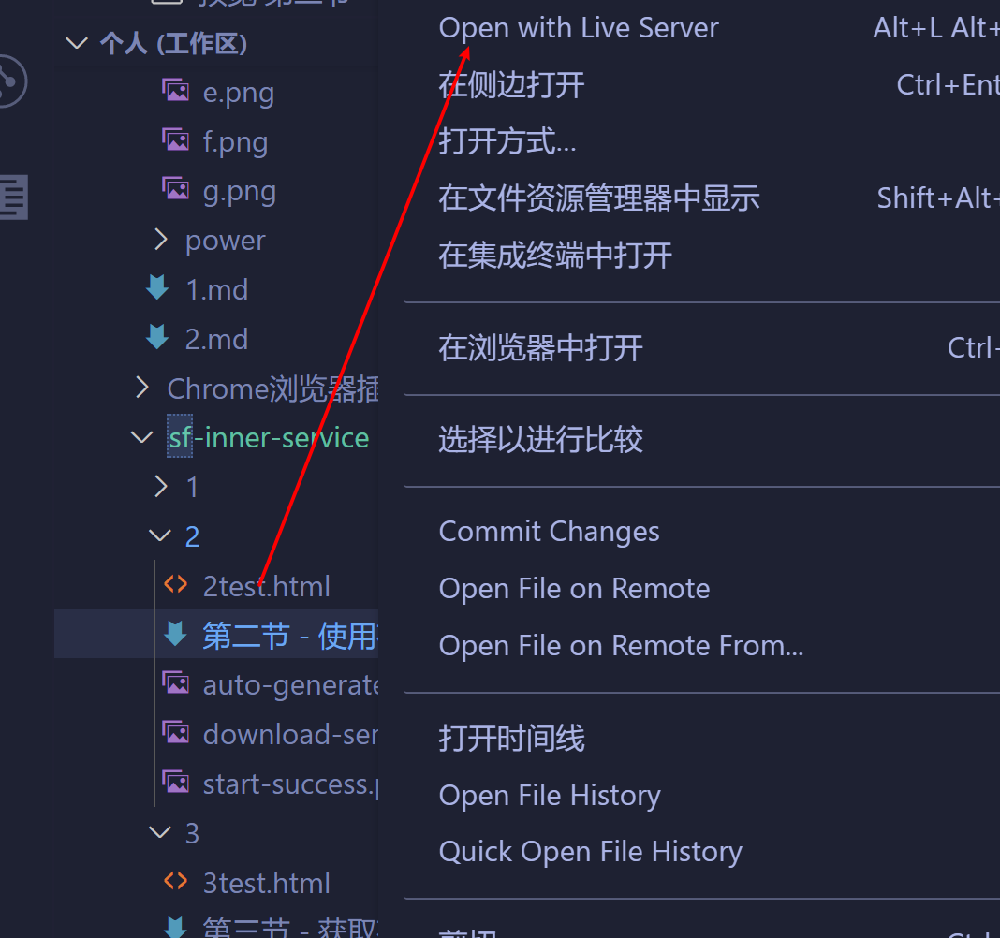
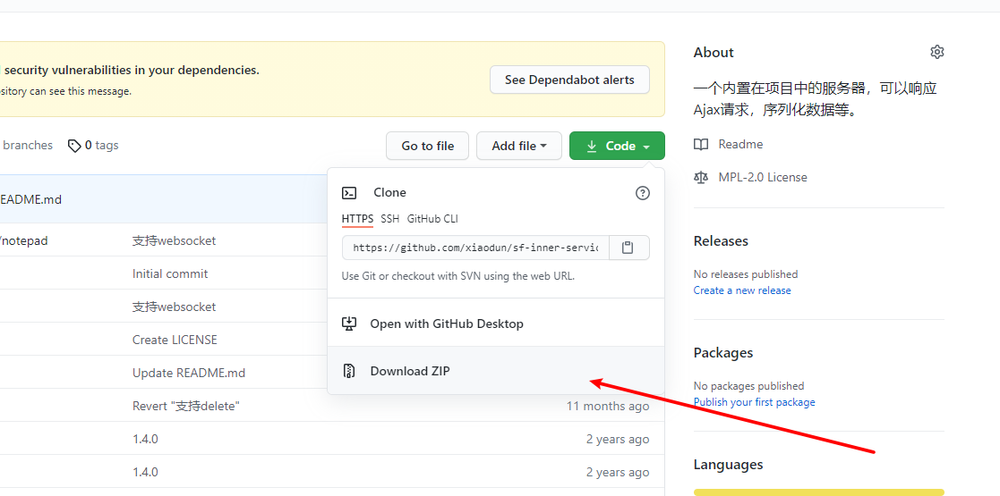

# start the service

In order to demonstrate the capabilities provided by sf-inner-service more purely, use a simple html file directly.

The Live Server plugin can be installed in VS code, and the separate html file can also refresh the page with the code update



To download the code locally, you must have a node.js environment.

Make a simple function, send the content of the text box to the server through the interface, and then store it

After decompression, install dependencies and execute `npm install`

Execute `node testService.js`

`port` is the port on which the server is running. If it is occupied, it needs to be changed. If the startup is successful, the address will be output. You can directly access it through this address. Of course, other devices under the same LAN as you can also access it.

In order to reduce the impact of local ip address changes, you can use localhost, 127.0.0.1 instead


# implement save

Open b.html in the browser, serviceUrl is the server address.

After the input content is clicked to save, a request of `/api/hero/chat/saveWord` will be initiated, and sf-inner-service will create the following structure under the data folder:

````
  api
    hero
      chat
        chat.json
        saveWord.js
````

- api unified prefix
- hero app name
- chat module name
- saveWord action name

There can be multiple levels, at least three, `/api/hero/saveWord` is equivalent to `/api/hero/hero/saveWord` in the mapping file structure


Cross-domain will generate an optios request, the return result is "{}"

Open `saveWord.js`, the program generates the default code

````
(function () {
  return function (argData, argParams) {
    //copy of argData data
    return {
      isWrite: false, //Whether to overwrite data
      //data:argData,//New data to be stored
      response: {
        code: 200,
        data: {
          //returned data
        },
      },
    };
  };
})();

````

Initialize the content of `chat.json` to **[]** , **This step is very important**, the structure that should be stored may also be an object **{}**

`argData` is the parsing of `chat.json`,

`argParams` carries the parameters passed by the front end

To achieve storage, you only need to change `saveWord.js` to the following format, no need to restart the service

````
(function () {
  return function (argData, argParams) {
    argData.push(argParams.word);
    return {
      isWrite: true,
      data: argData,
      response: {
        code: 200,
        data: {},
      },
    };
  };
})();

````

`code` is 200, which corresponds to 200 for http status, and can be changed to other status codes to simulate error requests, such as 404

Click Save again, at this time `chat.json` has stored the content passed by the front end

````
[
    "23434243243"
]
````

# implement the search

Added a function of "get historical information", which can perform fuzzy matching

Note that sf-inner-service will only create the default file structure, and the program logic has to be written by yourself

At this time, there is only a "getHistoryList.js" file under "api/hero/chat". Like "saveWord.js", you can manipulate the file content of "chat.json"

argData represents the data in "chat.json", just return it

````
(function () {
  return function (argData, argParams) {
    return {
      isWrite: false,
      response: {
        code: 200,
        data: argData,
      },
    };
  };
})();

````

To implement search, you need to give the content input by the user to `getHistoryList.js`. For sf-inner-service, the get and post requests are the same, and only these two parameters are parsed. The parsed parameters are all Put it in `argParams`, the code is as follows

````
(function () {
  return function (argData, argParams) {
    const list = argData. filter(
      (item) => item.indexOf(argParams.searchStr) !== -1
    );
    return {
      isWrite: false,
      response: {
        code: 200,
        data: list,
      },
    };
  };
})();
````

# implement delete

Pass the index selected by the user to the interface, which is essentially the same operation as deleting an item in the array, but rewrite the processed data to `chat.json`, see `delHistoryByIndex.js` for the code

# implement the modification

See the code in `updateHistoryByIndex.js`