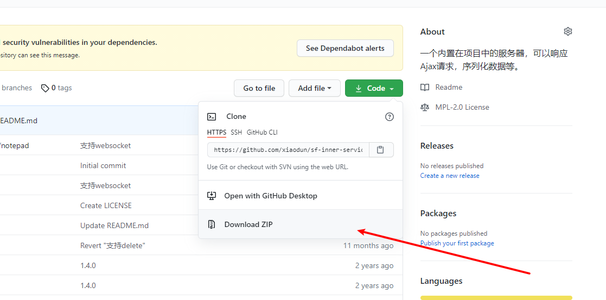

# 启动服务

为了更加纯粹的演示 sf-inner-service 所提供的能力,直接用简单的 html 文件。

VS code 中可以安装 Live Server 插件，单独的 html 文件也可以随着代码的更新刷新页面


下载代码到本地，本地要安装 Node.js 环境。


做一个简单的功能，将文本框的内容通过接口发送给服务器，然后存储起来

解压后安装依赖，执行`npm install`

执行` node testService.js`

`port` 是服务器运行的端口，如果被占用，则需要更改,启动成功会输出地址，您可以通过这个地址直接访问,当然，和您在同一个局域网下的其它设备也能访问

为了减少本机 ip 地址变化带来的影响，可以使用 localhost、127.0.0.1 代替


# 实现保存

在浏览器打开 b.html,serviceUrl 就是服务器地址,输入内容点击保存后

`sf-inner-service`会在 data 文件夹下创建以下结构

```
  api
    hero
      chat
        chat.json
        saveWord.js
```

已`/api/hero/chat/saveWord`为例

- api 是统一前缀
- hero 应用名
- chat 模块名
- saveWord 动作名

应保证至少有上述四个部分


跨域会产生一个 optios 请求，返回结果为"{}"

打开`saveWord.js`,程序生成了默认代码

```
(function () {
  return function (argData, argParams) {
    //argData 数据的副本
    return {
      isWrite: false, //是否覆盖数据
      //data:argData,//需要存储的新数据
      response: {
        code: 200,
        data: {
          //返回的数据
        },
      },
    };
  };
})();

```

将`chat.json`的内容初始化为 **[]** ,**这一步很关键**,应为存储的结构也有可能是对象**{}**

`argData`是对`chat.json`的解析，

`argParams`携带前端传递过来的参数

实现存储只需要将`saveWord.js`更改为如下格式,无须重启服务

```
(function () {
  return function (argData, argParams) {
    argData.push(argParams.word);
    return {
      isWrite: true,
      data: argData,
      response: {
        code: 200,
        data: {},
      },
    };
  };
})();

```

再次点击保存，此时`chat.json`已经存储了前端传递过来的内容了

```
[
    "23434243243"
]
```

# 实现查找

新增一个"获取历史信息"的功能,可以进行模糊匹配

注意，sf-inner-service 只会创建默认的文件结构,程序逻辑还要自己编写

此时，"api/hero/chat"下面只是多了"getHistoryList.js"文件,与"saveWord.js"一样,可以操作"chat.json"的文件内容

argData 代表"chat.json"里的数据,只需要将它返回就可以了

```
(function () {
  return function (argData, argParams) {
    return {
      isWrite: false,
      response: {
        code: 200,
        data: argData,
      },
    };
  };
})();

```

实现搜素，需要将用户输入的内容给到`getHistoryList.js`,对于 sf-inner-service 来说,get、post 请求是一样的并只做了这两种参数的解析,解析好的参数都放在`argParams`,代码如下

```
(function () {
  return function (argData, argParams) {
    const list = argData.filter(
      (item) => item.indexOf(argParams.searchStr) !== -1
    );
    return {
      isWrite: false,
      response: {
        code: 200,
        data: list,
      },
    };
  };
})();
```

# 实现删除

将用户选择的索引传给接口,本质上和数组中的一项时相同操作，但要将处理好的数据重新写入到`chat.json`,代码见`delHistoryByIndex.js`

```


# 实现修改

代码见 `updateHistoryByIndex.js`

```
